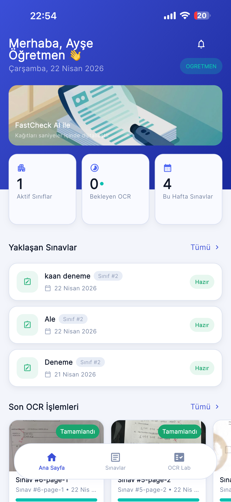
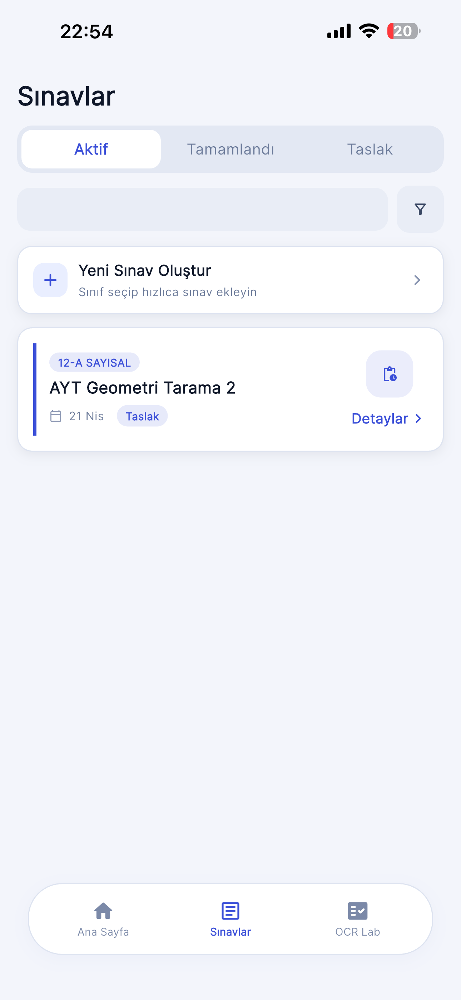
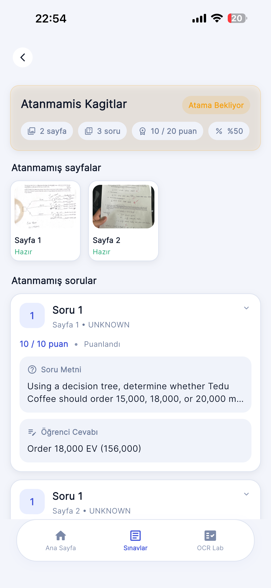
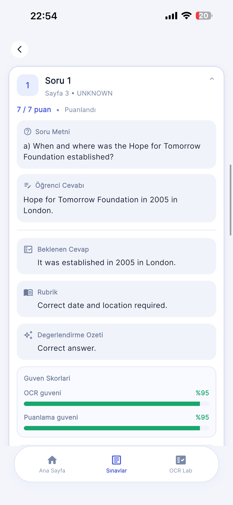
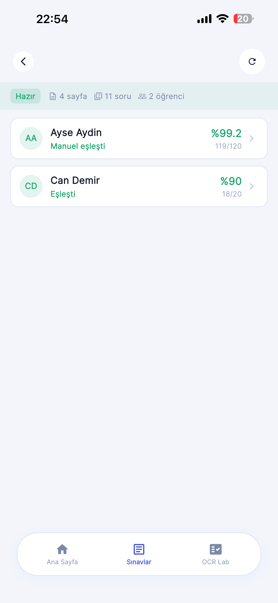
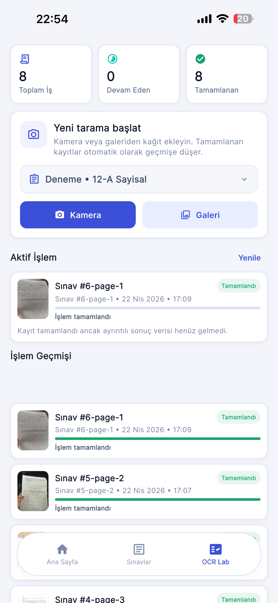
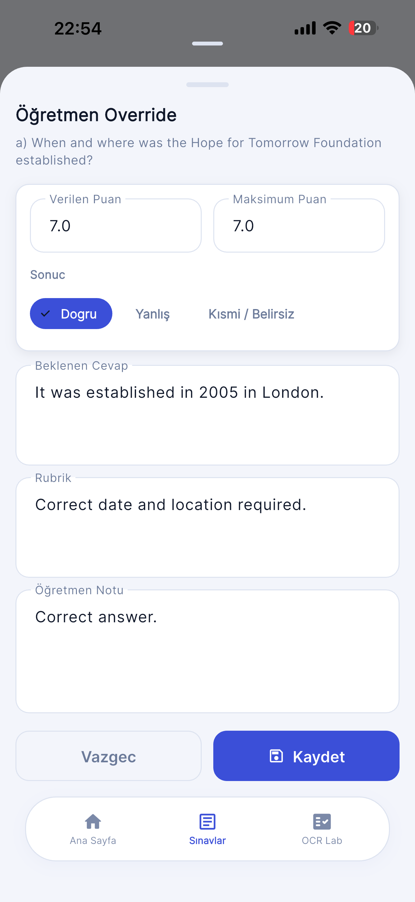

# FastCheck

FastCheck is a multi-service education platform focused on exam workflow automation.

Teachers create classes and exams, upload exam paper images, and trigger OCR extraction. Students and parents can track exam progress and view question details through role-based mobile experiences. The platform is built with a Spring Boot backend, a FastAPI OCR microservice, and a Flutter mobile client.

## Why FastCheck

- Role-based education workflow (`Admin`, `Teacher`, `Student`, `Parent`)
- Asynchronous OCR pipeline for exam paper processing
- Production-ready reverse proxy and Docker deployment setup
- JWT-based authentication and service-to-service authorization
- Mobile-first client for daily teacher/student/parent operations

## Monorepo Structure

```text
.
├── backend/fastcheck/     # Spring Boot API + business logic + auth + file endpoints
├── ai/                    # FastAPI OCR service + LLM integration + schema validation
├── frontend_mobile/       # Flutter mobile app
├── nginx/                 # Reverse proxy configuration
├── screenshots/           # App screenshots
├── docker-compose.yml     # Full production stack (postgres, springboot, fastapi, nginx)
└── DEPLOYMENT.md          # Deployment notes and routing details
```

## Architecture Overview

### 1) Backend API (`backend/fastcheck`)

- Framework: Spring Boot
- Java version: 21
- Database: PostgreSQL (production), H2 (demo/local testing)
- Authentication: JWT access/refresh tokens
- API docs: Swagger UI
- Responsibilities:
  - User and role management
  - School, class, student, and parent relations
  - Exam lifecycle management
  - File upload and public file serving
  - OCR job orchestration and status tracking

### 2) OCR Service (`ai`)

- Framework: FastAPI
- Core libs: `fastapi`, `uvicorn`, `openai`, `pydantic`, `PyJWT`
- Responsibilities:
  - Accept exam image URL input
  - Run OCR/LLM extraction flow
  - Return strict JSON payloads validated against schema
  - Enforce service JWT validation

### 3) Mobile Client (`frontend_mobile`)

- Framework: Flutter (Dart SDK `^3.6.0`)
- Architecture patterns: feature-based modules + BLoC + DI
- Core packages include: `flutter_bloc`, `dio`, `go_router`, `flutter_secure_storage`, `google_fonts`, `shadcn_ui`
- Features available by module:
  - `auth`
  - `admin`
  - `teacher`
  - `student`
  - `parent`
  - `ocr`

### 4) Edge/Proxy Layer

- Nginx routes external traffic:
  - `/api/` -> Spring Boot
  - `/ai/` -> FastAPI
  - `/healthz` -> Nginx health endpoint
- `cloudflared` can expose public domain routing (documented in `DEPLOYMENT.md`)

## Core Product Flow

1. Teacher creates classes and exams.
2. Teacher uploads exam images.
3. Backend stores uploads and triggers OCR asynchronously.
4. OCR service extracts structured exam content from image URLs.
5. Backend updates exam/question statuses.
6. Student and parent roles consume finalized exam and question data.

## Key API Surface

The backend exposes role-oriented endpoints, including:

- Auth:
  - `POST /auth/register`
  - `POST /auth/login`
  - `POST /auth/refresh`
- Teacher:
  - `POST /v1/teacher/classes`
  - `POST /v1/teacher/classes/{classId}/exams`
  - `POST /v1/teacher/exams/{examId}/images`
  - `GET /v1/teacher/exams/{examId}`
  - `GET /v1/teacher/dashboard`
- Student:
  - `GET /v1/student/exams`
  - `GET /v1/student/exams/{examId}/questions`
  - `GET /v1/student/dashboard`
- Parent:
  - `GET /v1/parent/students/{studentId}/exams`
  - `GET /v1/parent/students/{studentId}/exams/{examId}/questions`
  - `GET /v1/parent/dashboard`
- Admin:
  - School and user/relationship management endpoints under `/v1/admin/*`

FastAPI OCR endpoint:

- `POST /v1/ocr/exams:extract`

## Quick Start (Docker)

Use this method when you want the complete stack in one command.

### Prerequisites

- Docker + Docker Compose
- A valid `OPENROUTER_API_KEY`

### Steps

1. Create environment file:

```bash
cp .env.example .env
```

2. Fill required secrets in `.env`:

- `POSTGRES_PASSWORD`
- `APP_JWT_SECRET`
- `FASTAPI_SERVICE_JWT_SECRET`
- `OPENROUTER_API_KEY`

3. Start services:

```bash
docker compose up -d --build
```

4. Validate health and routes:

- `http://127.0.0.1:${NGINX_PORT:-8081}/healthz`
- `http://127.0.0.1:${NGINX_PORT:-8081}/api/`
- `http://127.0.0.1:${NGINX_PORT:-8081}/ai/healthz`

## Local Development

### Backend (Spring Boot)

```bash
cd backend/fastcheck
./mvnw spring-boot:run
```

Swagger UI:

- `http://localhost:8080/swagger-ui/index.html`

Demo seed data file:

- `backend/fastcheck/docs/seeds/h2-demo-data.sql`

Optional mock OCR mode:

```bash
SPRING_PROFILES_ACTIVE=mock-ocr ./mvnw spring-boot:run
```

### OCR Service (FastAPI)

```bash
cd ai
python -m venv .venv
source .venv/bin/activate
pip install -r requirements.txt
uvicorn app.main:app --host 0.0.0.0 --port 8000 --reload
```

Health endpoint:

- `http://127.0.0.1:8000/healthz`

### Mobile App (Flutter)

```bash
cd frontend_mobile
flutter pub get
flutter run
```

Default API base URL is:

- `https://api.efeatas.dev/api`

Override for another environment:

```bash
flutter run --dart-define=API_BASE_URL=https://your-api-host/api
```

## Environment and Security Notes

- Service-to-service OCR calls use JWT and should never run with weak/shared secrets.
- Configure CORS via backend environment (`APP_CORS_ALLOWED_ORIGINS`).
- Persisted volumes in Docker:
  - `postgres_data`
  - `uploads_data`
- Public file URLs should align with `APP_FILES_PUBLIC_BASE_URL`.

## API Tooling

- Postman collection:
  - `backend/fastcheck/docs/postman/FastCheck-Education.postman_collection.json`
- Insomnia export:
  - `backend/fastcheck/docs/insomnia/FastCheck-Education.insomnia.json`

## Screenshots

### Dashboard



### Exams List



### Exam Paper Detail



### Exam Question Detail



### Student List in Exam Context



### OCR Lab Screen



### Teacher Question Override



## Additional Documentation

- Deployment guide: `DEPLOYMENT.md`
- AI service details: `ai/README.md`
- OCR integration contract: `ai/docs/API_INTEGRATION.md`
- Backend endpoint summary: `backend/fastcheck/README.md`
- Mobile app notes: `frontend_mobile/README.md`
